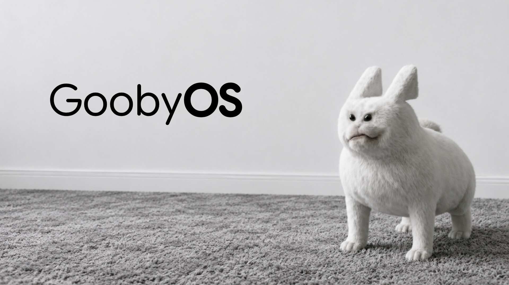

  

# gubgubOS 

A tiny 16-bit x86 operating system written from scratch in Assembly for Gooby. 

It boots straight off a floppy disk or ISO into a custom interactive shell where you can run commands and chat with Verity.

---

## What's inside?

- **Custom Bootloader:** A 512-byte MBR bootloader that handles loading the shell directly into memory.
- **Gooby Shell:** Interactive CLI with working keyboard input and backspace support.
- **Built-in Commands:**
  - `help` — Shows the command list.
  - `about` — Tells you a little about gubgubOS.
  - `ver` — Displays the OS version.
  - `echo` — Repeats whatever text you type.
  - `clear` — Wipes the terminal screen clean.
  - `reboot` — Restarts the machine using BIOS interrupts.
  - `verity` — Starts a chat with Verity (you can also try `verity france`, `verity cow`, or `verity friend`).
  - And more!
---

## Releases & Builds

Every time code is pushed to the repository, GitHub Actions automatically compiles the system, bumps the version tag, and uploads a fresh `gubgubOS.iso` to the Releases tab.

